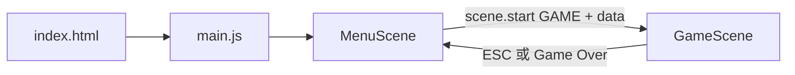

# 詐騙手遊廣告實體化 

Phaser 3 網頁小遊戲專案骨架，主選單與 GameScene 分離，方便組員並行開發。

## 目錄結構

```
scam-game-ad/
├── index.html              # 載入 Phaser CDN 與所有 JS（載入順序固定）
├── README.md
└── js/
    ├── main.js             # Phaser 初始化、註冊 Scene
    ├── config/
    │   └── GameConfig.js   # 全組共用常數（畫面、Scene 名稱、增益類型）
    └── scenes/
        ├── MenuScene.js    # 【同學】主選單、開始遊戲按鈕
        └── GameScene.js    # 【你】數字門射擊關完整邏輯
```

## Scene 流程



## 同學接入主選單（MenuScene）

1. 在 `MenuScene.js` 的 `create()` 裡做 UI（背景、標題、按鈕）。
2. 開始遊戲時呼叫：

```javascript
this.scene.start(GameConfig.SCENES.GAME, {
  level: 1,
  difficulty: 'normal',
});
```

3. `GameScene.init(data)` 會合併 `GameConfig.DEFAULT_GAME_DATA`，之後可用 `this.levelData.level` 調整難度。

4. 新增其他小遊戲：在 `main.js` 的 `scene: []` 註冊新 class，並在選單用 `this.scene.start('OtherSceneKey')` 切換。

## GameScene 職責（你已實作）

| 模組 | 說明 |
|------|------|
| 玩家 | 底部藍色方塊，觸控/拖曳左右移動 |
| 子彈 | 黃色長條，自動向上射擊，物件池回收 |
| 敵人 | 紅色方塊自上而下，頭頂 HP 數字 |
| 碰撞 | Arcade `overlap`：子彈→敵人扣血、玩家→敵人 Game Over |
| 死亡 | HP≤0 時粒子爆炸、加分 |
| 數字門 | 藍/紅門 + 運算標籤，穿過一次套用增益（射速/攻擊/槍數） |

### 玩家屬性（可被數字門修改）

```javascript
this.playerStats = {
  fireRate: 400,  // ms，越小越快
  damage: 1,
  gunCount: 1,
};
```

### 擴充數字門

在 `GameScene._createGates()` 的 `gateConfigs` 陣列新增一筆：

```javascript
{
  x: width * 0.5,
  color: GameConfig.GATE.BLUE,
  op: '×',
  value: 2,
  buff: GameConfig.BUFF.DAMAGE,
  label: '攻擊×2',
  isDebuff: false,
}
```

`buff` 必須是 `GameConfig.BUFF` 其中一項；`isDebuff: true` 時數值會反向套用。

## 本地執行（必讀：無法載入時）

**一定要用 HTTP 伺服器**，不能直接雙擊 `index.html`（`file://` 會失敗）。

**伺服器根目錄必須是 `scam-game-ad` 這個資料夾**，不是上一層 `Devs`。

```bash
cd c:\Devs\scam-game-ad
npm start
```

終端機會顯示例如 `http://localhost:3456` — 把**整段網址**貼到瀏覽器，應看到主選單。

### 常見錯誤

| 狀況 | 解法 |
|------|------|
| 空白頁 / 一直轉圈 | 確認在 `scam-game-ad` 內執行 `npm start` |
| 開到 `Devs` 根目錄 | 網址應為 `http://localhost:3456/`，不是沒有遊戲的上層資料夾 |
| Cursor 埠轉發 | 用終端機印出的 port，在 Ports 面板 Forward 後開啟 |
| CDN 被擋 | `index.html` 已內建多個 Phaser CDN 備援 |

若仍失敗，畫面上會顯示紅色錯誤說明。

開發時可在 `main.js` 將 `physics.arcade.debug` 設為 `true` 查看碰撞框。

## 後續可分工擴充

- **美術**：把 `rectangle` 換成 `this.load.image` + sprite****
- **關卡**：依 `this.levelData.level` 調整 `gateConfigs`、敵人 spawn 間隔
- **音效**：`this.sound.add` 在擊中/過門時播放
- **廣告梗**：誇張 UI 文案、假五星評價彈窗（可放在 MenuScene 或 GameScene overlay）

## 操作

- 畫面下方拖曳：移動士兵
- 自動射擊
- 穿過數字門：獲得增益（每門僅一次）
- `ESC`：返回主選單（暫時除錯用）

##參考就好
- 由於某人在亂搞，所以整個就，我也不知道
